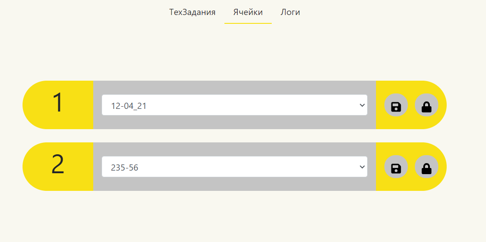
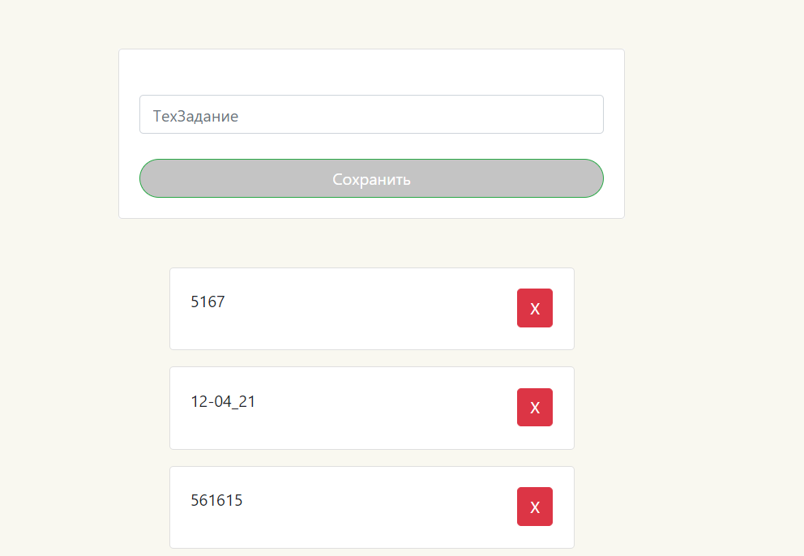
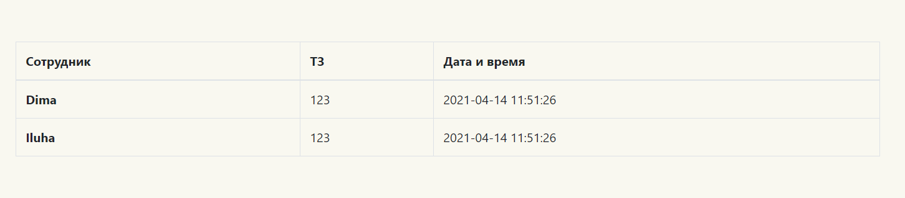

# Сервер
Сервер отвечает за управдение состоянием системы. Он отвечает на запросы от клиентской части, обрабатывает данные датчиков, работает с базой данных.

Сервер написан на языке Python, c использованием фреймворка Flask. В качестве СУБД используется SQLite. Все необходимые для запуска зависимости находятся в файле `requirements.txt`. Так как для работы серверу необходима свзяь с другими компонентами, в проекте есть файлы, которые используют специфичные для *Raspberry Pi* библиотеки, например *RPI.GPIO* для упраяления выходами платы и *smbus* для обеспечиения *I2C* связи с *Arduino*. **Поэтому во время тестого запуска на компьюторе, отличающимся от *Raspberry Pi* могут возникать ошибки.** Для избежания данной ситуации рекомендуется коментировать проблемные места, а работу с компонентами тестировать непосредственно на *Raspberry Pi*. 

## Работа с клиентской частью
Для обращения к серверу необходимо узнать его **IP адресс в локальной подсети** и перейти по нему с **портом 5000**. 
### Главная страница
Главная страница представляет собой список доступных ячеек:

Выпадающий список позволяет выбрать существующую задачу. Для этого надо **выбрать задачу** и **нажать на кнопку сохранения** (первая). Вторая кнопка позволяет открыть соответствующую ячейку. 
Для получения данной страницы в файле `views/views.py` опеределна функция:
```python
@app.route('/')
def boxes():
 return render_template('index.html', boxes=BoxService.show_all(), tasks=TechTaskService.show_all())
```
Для отображения в папке `app/templates` создан шаблон `index.html`, который принимает на вход два списка: **список ячеек** и **список существующих задач**. Главное место в шаблоне это:
```html

    <div class="container-fluid">
        <div class="row">
            <div class="col-md-3 "></div>
            <div class="col-md-1 left" align="center">{{ box.box_id }}</div>
            <div class="col-md-4">
                <form action="/box/change" id="task_change{{ box.box_id }}" method="post">
                    <select name="task" class="form-control" align="center">
                        <option selected
                                value="{{ box.box_id }} - {{ box.tech_task_id }}">{{ box.tech_task_id }} </option>
                        <option value="{{ box.box_id }} - none">---</option>
                        
                            <option value="{{ box.box_id }} - {{ task.tech_task_id }}">{{ task.tech_task_id }}</option>
                        
                    </select>
                </form>
            </div>
            <div class="col-md-1 right" align="center">
                <div>
                    <button type="submit" form="task_change{{ box.box_id }}" class="btn btn-circle">
                        
                    </button>
                    <button type="button" class="btn btn-circle" id="{{ box.box_id }}"></button>
                </div>
            </div>
        </div>
    </div>
    <br>

```
Тут как раз и генерируются ячейки. **Ознокомиться с данной технологией можно [тут](https://habr.com/ru/post/346340/).**

После нажатия на копку сохранения, на сервер отправляется **POST запрос** с содержимым формы. Для обработки этого события есть функция `change_box()`:
```python
@app.route('/box/change', methods=['POST'])
def change_box():
    BoxService.save(request.form.get('task'))
    return redirect('/', code=302)
```
Данная функция перенапрявляет содержимое формы в класс, отвечающий за работу с ячейками. Его описание находится **ниже**.

После нажатия на кнопку открытия ячейки, отрабатывет следующий скрипт (`app/static/index.js`):
```javascript
document.body.addEventListener("click", function (event) {
    console.log("Clicked", event.target.id);
    let url = '/box/open/' + event.target.id;
    let xhr = new XMLHttpRequest();
    xhr.open('GET', url, false);
    xhr.send();
});
```
Для обработки этих запросов есть функция `open_slot_debug`:
```python
@app.route('/box/open/<box_id>')
def open_slot_debug(box_id):
    app.logger.info(box_id)
    open_slot(int(box_id))
    return redirect('/', code=302)
```
Данная функция **достаёт из url** запроса **id ячейки** и **открывает** ячейку с данным номером. Описание работы функции `open_slot()` находится [тут](./devices.md).
### Страница задач

### Страница логов
